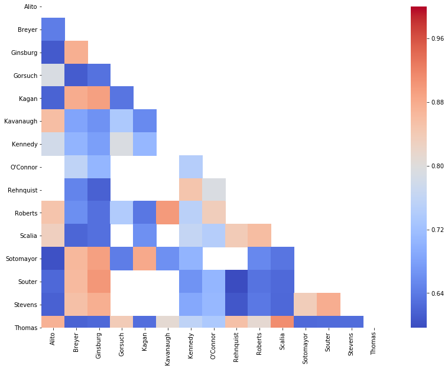

# Similarity of Supreme Court Justices from 1999 to 2019
Contributors: Wayne Lam

Data: wikipedia.org (scraped)

## Motivation
From early to mid-2020 US Chief Justice John Roberts sided with the "liberal" wing of the US Supreme Court.  He is a George W. Bush appointment which prompted many to think he would be a "conservative" justice.  There are several different [methodologies](https://en.wikipedia.org/wiki/Ideological_leanings_of_United_States_Supreme_Court_justices) in terms of determining whether a justice is "conservative" vs. "liberal".  Often these ratings are based on how a justice votes on a particular case and are commonly dependent on the liberal/conservative paradigm where issues can be mapped onto 1 axis.  However, there are times when those 2 labels (and the corresponding 1 axis mapping) might not provide certain depth of insight as we have recently witnessed justices voting/writing opinions on certain cases that often run counter to what many observers had expected.  Unlike the "liberal" and "conservative" labels, certain justices (mostly the "conservative" justices) have self-labeled themselves as textualists (Thomas, Gorsuch), originalists (Alito), or none (Roberts); as a lay person it can be hard to understand what those labels truly mean in the legal/judicial world.

This project hopefully is able to produce insight into ideological similarity of justices based on voting similarity.  The liberal/conservative paradigm is not used and instead a similarity matrix is formed by using cosine similarity.

## EDA
### Supreme Court Justice Cosine Similarity

